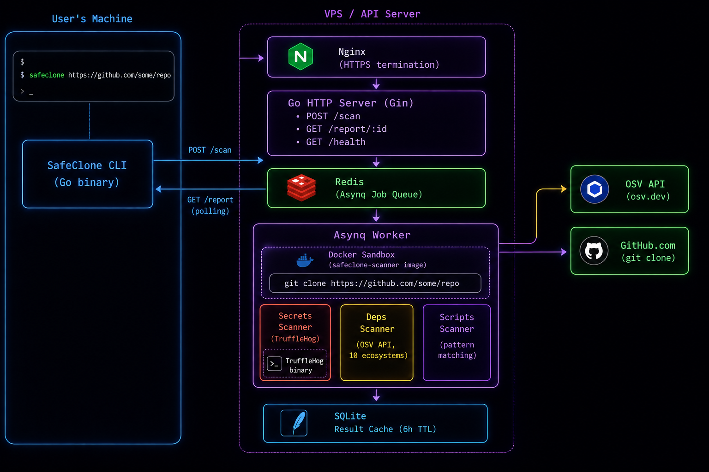

# SafeClone — Architecture

## Overview

SafeClone is a CLI-first security tool that intercepts the `git clone` workflow. The user runs a single command; a remote server scans the target repository inside an isolated Docker sandbox and returns a verdict — before any code touches the user's machine.



---

## System Components

### 1. CLI (User's Machine)

The SafeClone CLI is a statically compiled Go binary distributed via Homebrew (macOS/Linux) and Scoop (Windows). It has no runtime dependencies and requires nothing to be installed in each project.

**Responsibilities:**
- Accept a GitHub URL from the user
- Send `POST /scan` to the API server
- Poll `GET /report/:jobID` every 2 seconds until the scan completes
- Display the verdict and findings
- Prompt the user before cloning if issues are found
- Run `git clone` on approval

**Key flags:**
| Flag | Description |
|---|---|
| `--dir` | Custom destination folder name |
| `--force` | Clone without prompting even if issues found |

**Environment:**
| Variable | Default | Description |
|---|---|---|
| `SAFECLONE_API` | `https://api.safeclone.dev` | API server base URL |

---

### 2. API Server (VPS)

A Go HTTP server built with [Gin](https://github.com/gin-gonic/gin), running behind Nginx with TLS termination via Certbot.

**Endpoints:**

| Method | Path | Description |
|---|---|---|
| `POST` | `/scan` | Accept a repo URL, check cache, enqueue scan job |
| `GET` | `/report/:jobID` | Return current status and report for a job |
| `GET` | `/health` | Health check — returns `{"status":"ok"}` |

**Scan flow:**
1. Receive URL
2. Check SQLite for a completed scan of the same URL within the last 6 hours
3. If cached → return existing job ID immediately (`"cached": true`)
4. If not → create a new job row in SQLite, enqueue task into Redis via Asynq, return new job ID

---

### 3. Job Queue (Redis + Asynq)

[Asynq](https://github.com/hibiken/asynq) is a Go task queue backed by Redis. It handles:
- Concurrent scan execution (concurrency: 3)
- Automatic retries on failure
- Task lifecycle management (pending → active → done/failed)

The worker runs in the same process as the API server as a background goroutine.

---

### 4. Asynq Worker

The worker picks up scan jobs from Redis and executes them. Each job:

1. **Clones the repo** inside a Docker sandbox using the `safeclone-scanner` image (Ubuntu 24.04 + git + TruffleHog)
2. **Runs three scanners in parallel** using Go goroutines
3. **Aggregates results** into a unified report
4. **Computes a verdict** (safe / warning / dangerous)
5. **Saves the report** to SQLite

---

### 5. Docker Sandbox

The `safeclone-scanner` Docker image is a minimal Ubuntu 24.04 environment containing:
- `git` — for cloning
- `curl`, `ca-certificates` — for network access
- `nodejs`, `npm`, `python3` — for ecosystem support
- `trufflehog` — for secret detection

The container is created per scan, runs `git clone`, mounts the result directory, then is destroyed. This ensures:
- Malicious install scripts cannot execute on the host
- Each scan starts from a clean state
- Resource limits (512MB RAM, 0.5 CPU) prevent abuse

---

## The Three Scanners

### Secrets Scanner

Invokes TruffleHog against the cloned filesystem:

```
trufflehog filesystem <path> --json --no-update --only-verified \
  --exclude-paths=<file containing: testdata, fixtures, test, mocks, examples>
```

Key decisions:
- `--only-verified` — only reports credentials that TruffleHog can confirm are active via a live API call. Eliminates the majority of false positives.
- Exclude paths — test fixtures and mock files are excluded to avoid noise.
- A 5-minute context timeout prevents hung scans.

---

### Dependency Scanner

Reads package manifests from the cloned repo and queries the [OSV.dev](https://osv.dev) batch API with exact version pinning.

**Supported ecosystems:**

| Ecosystem | Manifest file | OSV name |
|---|---|---|
| npm | `package.json` | `npm` |
| PyPI | `requirements.txt` | `PyPI` |
| Go modules | `go.mod` | `Go` |
| Cargo (Rust) | `Cargo.toml` | `crates.io` |
| Maven (Java) | `pom.xml` | `Maven` |
| RubyGems | `Gemfile.lock` | `RubyGems` |
| Packagist (PHP) | `composer.json` | `Packagist` |
| NuGet (.NET) | `*.csproj` / `packages.config` | `NuGet` |
| Pub (Dart/Flutter) | `pubspec.yaml` | `Pub` |
| Hex (Elixir) | `mix.exs` | `Hex` |

**Version pinning:**
Each ecosystem's version range notation is stripped to extract the base version (e.g. `^4.17.4` → `4.17.4`, `>=2.0,<3.0` → `2.0`). This ensures OSV only returns CVEs that affect the specific version declared in the repo, not all versions of the package.

**Severity:**
Results from OSV include CVSS scores. Any package with a score > 7.0 is marked `high`; otherwise `medium`.

---

### Scripts Scanner

Statically analyzes install-time hook content for dangerous patterns. No external calls — runs entirely in-process.

**Files inspected:**
- `package.json` — `preinstall`, `install`, `postinstall`, `prepare` hooks
- `setup.py` / `setup.cfg` — Python install hooks
- `Makefile` — install targets

**Patterns flagged:**

| Pattern | Risk |
|---|---|
| `eval(` / `exec(` | Dynamic code execution |
| `curl ... \| sh` / `wget ... \| sh` | Remote code execution |
| `base64` | Obfuscated payload |
| `rm -rf` | Destructive filesystem operation |
| `chmod +x` | Privilege escalation |
| `process.env` | Environment variable exfiltration |

---

## Verdict Logic

```
Has secrets?            ──► DANGEROUS
  └─► Prompts user before cloning. Default: abort.

No secrets, has vulns
or dangerous scripts?   ──► WARNING
  └─► Prompts user before cloning. Default: abort.

Nothing found?          ──► SAFE
  └─► Clones automatically without prompting.
```

---

## Storage (SQLite)

A single SQLite file (`safeclone.db`) stores all scan results.

**Schema:**
```sql
CREATE TABLE scans (
    id         TEXT PRIMARY KEY,       -- UUID
    url        TEXT NOT NULL,          -- GitHub repo URL
    status     TEXT NOT NULL DEFAULT 'pending',  -- pending | scanning | done | failed
    report     TEXT,                   -- JSON-encoded report
    error      TEXT,
    created_at DATETIME DEFAULT CURRENT_TIMESTAMP
);

CREATE INDEX idx_scans_url ON scans(url);
```

**Cache TTL:** Results are reused for 6 hours. Any scan request for a URL with a `done` result less than 6 hours old returns the cached result instantly.

---

## Infrastructure

| Component | Technology |
|---|---|
| VPS | Hetzner CX22 (ARM64, Ubuntu 24.04) |
| Reverse proxy | Nginx |
| TLS | Certbot (Let's Encrypt) |
| Process manager | systemd |
| Firewall | ufw (ports 22, 80, 443) |

---

## Distribution Pipeline

```
git tag v1.x.x
      │
      └─► GitHub Actions (release.yml)
               │
               └─► GoReleaser
                      ├─► Build 5 binaries (linux/amd64, linux/arm64,
                      │   darwin/amd64, darwin/arm64, windows/amd64)
                      ├─► Create GitHub Release with checksums
                      ├─► Push Homebrew formula → altship-hq/homebrew-safeclone
                      └─► Push Scoop manifest  → altship-hq/scoop-safeclone
```

**User install:**
```bash
# macOS / Linux
brew install altship-hq/safeclone/safeclone

# Windows
scoop bucket add altship-hq https://github.com/altship-hq/scoop-safeclone
scoop install safeclone
```

---

## Sequence Diagram

```
User          CLI              API Server        Redis        Worker         GitHub
 │             │                   │               │             │              │
 │  safeclone  │                   │               │             │              │
 │────────────►│                   │               │             │              │
 │             │   POST /scan      │               │             │              │
 │             │──────────────────►│               │             │              │
 │             │                   │ check cache   │             │              │
 │             │                   │──────────────►│             │              │
 │             │                   │◄──────────────│             │              │
 │             │                   │ enqueue job   │             │              │
 │             │                   │──────────────►│             │              │
 │             │   {job_id}        │               │             │              │
 │             │◄──────────────────│               │  dequeue    │              │
 │             │                   │               │────────────►│              │
 │             │  GET /report      │               │             │  git clone   │
 │             │──────────────────►│               │             │─────────────►│
 │             │  {status:pending} │               │             │◄─────────────│
 │             │◄──────────────────│               │             │              │
 │             │  (wait 2s)        │               │             │ run scanners │
 │             │  GET /report      │               │             │──────┐       │
 │             │──────────────────►│               │             │      │       │
 │             │  {status:done,    │               │             │◄─────┘       │
 │             │   report:{...}}   │               │  save result│              │
 │             │◄──────────────────│               │◄────────────│              │
 │  verdict    │                   │               │             │              │
 │◄────────────│                   │               │             │              │
 │  git clone  │                   │               │             │              │
 │────────────►│                   │               │             │              │
```

---

## Security Considerations

- **Sandboxed cloning** — repos are cloned inside Docker with memory (512MB) and CPU (0.5 core) limits. The host filesystem is not exposed.
- **No code execution** — SafeClone never runs any code from the scanned repo. TruffleHog and the scripts scanner operate purely on file contents.
- **Verified secrets only** — `--only-verified` means TruffleHog confirms a secret is active before reporting it, preventing panic over already-rotated credentials.
- **Rate limiting** — not yet implemented. Planned for a future release.
- **No user data stored** — only the repo URL and scan result are persisted. No user identity, IP addresses, or personal data.
